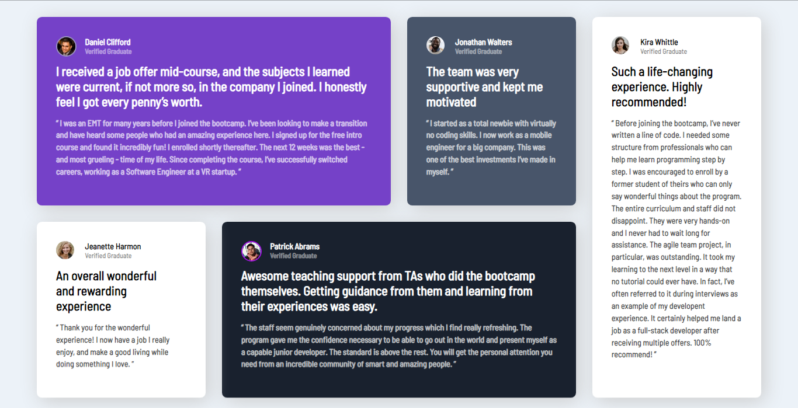

# Frontend Mentor - Testimonials grid section solution

This is a solution to the [Testimonials grid section challenge on Frontend Mentor](https://www.frontendmentor.io/challenges/testimonials-grid-section-Nnw6J7Un7). Frontend Mentor challenges help you improve your coding skills by building realistic projects. 

## Table of contents

- [Overview](#overview)
  - [The challenge](#the-challenge)
  - [Screenshot](#screenshot)
  - [Links](#links)
- [My process](#my-process)
  - [Built with](#built-with)
  - [What I learned](#what-i-learned)
  - [Continued development](#continued-development)
  - [Useful resources](#useful-resources)
- [Author](#author)
- [Acknowledgments](#acknowledgments)

**Note: Delete this note and update the table of contents based on what sections you keep.**

## Overview

### The challenge

Users should be able to:

- View the optimal layout for the site depending on their device's screen size

### Screenshot





### Links

- Solution URL: [Add solution URL here](https://your-solution-url.com)
- Live Site URL: [file:///C:/Users/hp%20prro/Downloads/testimonials-grid-section-main/testimonials-grid-section-main/index.html](https://your-live-site-url.com)

## My process

### Built with

- Semantic HTML5 markup
- CSS custom properties
- CSS Grid
- Mobile-first workflow

### What I learned

To see how you can add code snippets, see below:

```css
    .main_container_boite{
        display: grid;
        justify-content: center;
        grid-template-columns: calc((30% - 25px)) calc((30% - 25px)) calc((30% - 25px));
        grid-template-rows: fit-content fit-content fit-content;
        gap: 30px;
    }
    .daniel_container{
        order: 0;
    }
    .jeanette_container{
        order: 2;
    }
    .jonathan_container{
        order: 1;
    }
    .patrick_container{
        order: 3;
    }
    .kira_container{
        order: 4;
    }
    .main_container_boite{
        display: flex;
        margin: 15px 15px; 
        flex-direction: column;
        padding: 10px;
    }

```
## Author
- Frontend Mentor - [@daryl-tores](https://www.frontendmentor.io/profile/yourusername)

